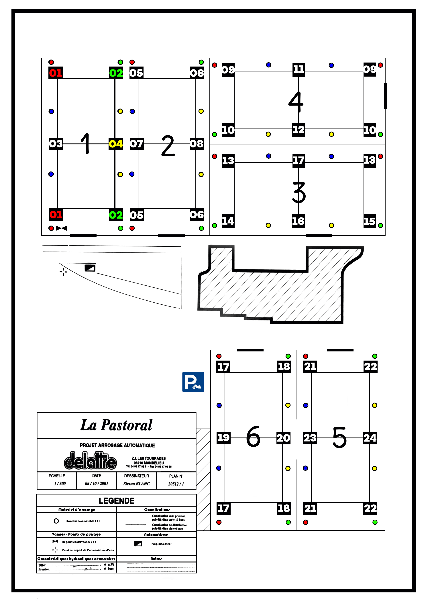

# SCH-006 — Plan d'arrosage de La Pastorale

**Statut :** Document source (plan constructeur numérisé)
**Version :** 1.0
**Date :** 2026-07-10
**Documents liés :** SITE-001 (La Pastorale), FIC-T01 à FIC-T06, REL-007, REL-008

## 1. Objet

Plan d'arrosage automatique de La Pastorale fourni par l'installateur.

- **Bureau d'étude :** Delattre (Z.I. Les Tourrades, 06210 Mandelieu)
- **Plan n° :** 20512 / 1
- **Échelle :** 1/300
- **Date du plan :** 08/10/2001
- **Dessinateur :** Stevan Blanc

> **Orientation : le nord est vers le bas du plan.**

## 2. Fichier

- [`SCH-006-plan-arrosage-la-pastorale.png`](./SCH-006-plan-arrosage-la-pastorale.png) — plan numérisé (cliquer pour ouvrir ou télécharger).

## 3. Contenu

Le plan représente la disposition réelle des six terrains de La Pastorale et
leur réseau d'arrosage :

| Zone | Emplacement sur le plan |
|---|---|
| Terrains 1 et 2 | en haut à gauche (format portrait, côte à côte) |
| Terrains 4 (haut) et 3 (bas) | à droite (format paysage, empilés) |
| Bâtiment / local | au centre |
| Parking | au centre, sous le bâtiment |
| Terrains 6 et 5 | en bas (format portrait, côte à côte) |

La légende décrit les arroseurs escamotables, les regards électrovannes 24 V,
le point de départ de l'alimentation d'eau, le programmateur et les
canalisations (série 10 bars sous pression, série 6 bars de distribution).

## 4. Usage

- Sert de fond de plan aux fiches de relevé **REL-007** (sorties d'eau terrain)
  et **REL-008** (sorties d'entretien) pour localiser les éléments par une croix.
- Complète, sans le remplacer, le schéma générique **SCH-005** (plan type terrain).

## 5. Règle

Ce plan reflète l'installation de 2001 : toute évolution constatée sur le
terrain prime et doit être notée `À confirmer` avant mise à jour des fiches.
Aucun code ni secret d'accès ne figure sur ce plan.
