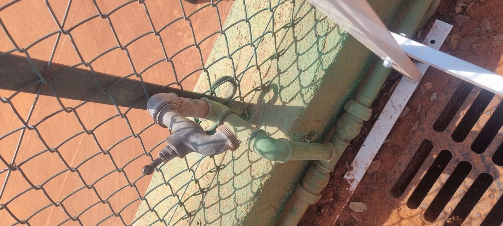

# EQ-002 — Sortie d'eau terrain type

**Statut :** En cours de relevé  
**Version :** 0.3  
**Date :** 2026-07-12  
**Standard lié :** STD-001

## 1. Objectif

Décrire la sortie d'eau type utilisée sur les terrains pour alimenter l'ensemble d'arrosage manuel.

## 2. Usage

La sortie terrain permet d'alimenter un tuyau Ø25 utilisé pour l'arrosage manuel de la terre battue (tuyau relevé sur site : TRICOFLEX Jaune Ø25 – 25 m, art. 048273 ; à rattacher à STD-003 / l'ensemble d'arrosage manuel).

Elle privilégie :

- le débit ;
- la robustesse ;
- l'ouverture/fermeture rapide ;
- la simplicité de réparation.

## 3. Configuration fonctionnelle

### 3.1 Configuration existante constatée (2026-07-11)

Relevé de terrain (photo de référence) : la sortie en place est un **robinet de puisage vissé** sur une remontée en tube galvanisé de la sortie réseau filetée femelle 1". Ce robinet fait **actuellement office de vanne primaire**. Voir `STD-001` § 3.

```text
Sortie réseau filetée femelle 1"
        ↓
Robinet de puisage vissé  (fait actuellement office de vanne primaire)
        ↓
Raccord Écrou femelle 1" → cannelé Ø25
        ↓
Tuyau souple Ø25 (Tricoflex Jaune)
```

Les sorties partagent cette base mais **ne sont pas identiques** : les robinets ont un fonctionnement équivalent, avec des **variations de tête** (diamètre) qui impactent la maintenance (pièces non interchangeables).



### 3.2 Configuration cible (STD-001 § 4)

```text
Sortie réseau femelle 1"
        ↓
Vanne primaire 1/4 tour 1" M/M
        ↓
Raccord 1" femelle → cannelé Ø25
        ↓
Tuyau Ø25 de l'ensemble d'arrosage manuel
```

> **Écart existant → cible :** le robinet de puisage vissé tient aujourd'hui lieu de vanne primaire ; la cible prévoit une vanne 1/4 tour 1" M/M dédiée (VAN-001).

## 4. Nomenclature

| Repère | Code | Désignation | Quantité | Remarques |
|---|---|---|---:|---|
| SR | — | Sortie réseau femelle 1" | 1 | Élément existant à relever |
| VP | VAN-001 | Vanne 1/4 tour 1" M/M | 1 | Vanne primaire |
| RC1 | RAC-001 | Écrou femelle 1" → cannelé Ø25 | 1 | Liaison vers tuyau |
| COL | COL-001 | Collier inox Ø25 | À confirmer | Selon montage |

## 5. Implantation sur site

Base commune confirmée pour toutes les sorties (voir § 3.1). Répartition **confirmée** par le relevé REL-007 (issue #71) : **10 sorties** (`SET-01` à `SET-10`). L'état détaillé par sortie (type/tête de robinet, état) reste à relever.

| Terrain | Sorties (SET) | Nombre | Usage actuel | État | Particularités |
|---|---|---:|---|---|---|
| S1-T01 | SET-01 | 1 | SET | À relever | |
| S1-T02 | SET-02, SET-03 | 2 | SET / SEM | À relever | `SET-03` : repère SET, usage actuel SEM (maintenance) |
| S1-T03 | SET-04, SET-05, SET-06 | 3 | SET | À relever | |
| S1-T04 | SET-07, SET-08 | 2 | SET | À relever | `SET-08` : raccordement à vérifier (photo à fournir) |
| S1-T05 | SET-09 | 1 | SET | À relever | |
| S1-T06 | SET-10 | 1 | SET | À relever | |

## 6. Points de contrôle

- [ ] La vanne primaire est accessible.
- [ ] La poignée ne gêne pas le passage.
- [ ] Le raccord ne fuit pas.
- [ ] Le tuyau peut être monté sans vrillage excessif.
- [ ] La sortie est protégée des chocs autant que possible.
- [ ] Le montage correspond à STD-001.

## 7. Pannes fréquentes

| Symptôme | Cause probable | Action |
|---|---|---|
| Fuite au filetage | Étanchéité défaillante | Refaire étanchéité |
| Vanne bloquée | Usure / encrassement | Remplacer VAN-001 |
| Raccord cassé | Choc / vieillissement | Remplacer RAC-001 |
| Débit faible | Problème tuyau, buse ou amont | Appliquer PROC-003 |

## 8. Photos à ajouter

- [x] Sortie type conforme. — voir § 3.1 (`S1-SET-reference-existante-2026-07-11.jpg`)
- [ ] Exemple de sortie non conforme.
- [ ] Détail de la vanne primaire.
- [ ] Détail du raccord cannelé.

## 9. Documents liés

- STD-001 — Sortie d'eau terrain
- STD-003 — Ensemble d'arrosage manuel
- PROC-001 — Monter une sortie terrain standard
- PROC-003 — Diagnostiquer une sortie d'eau à faible débit
- REF-001 — Raccords, vannes et accessoires d'arrosage
- STOCK-001 — Stock arrosage

## 10. Historique

| Version | Date | Auteur | Description |
|---|---|---|---|
| 0.1 | 2026-07-09 | Peter / ChatGPT | Création de la fiche équipement initiale |
| 0.2 | 2026-07-12 | Peter / Claude | Ajout de la configuration existante constatée + photo de référence ; alignement sur STD-001 v0.2 ; tuyau relevé (TRICOFLEX Jaune Ø25) (issue #7) |
| 0.3 | 2026-07-12 | Peter / Claude | Implantation par SET confirmée (10 sorties, SET-03 usage SEM, SET-08 à vérifier) ; vocabulaire raccord normalisé ; note variations de robinets (issue #71) |
